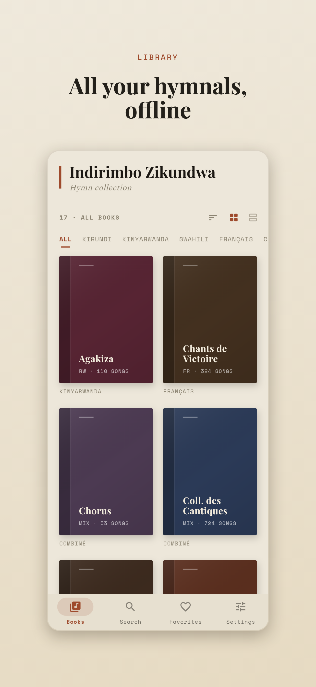
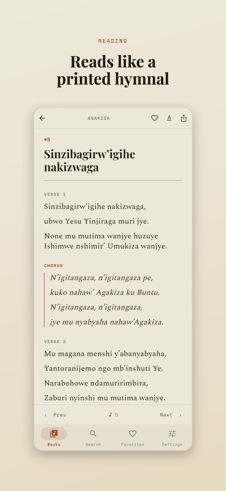
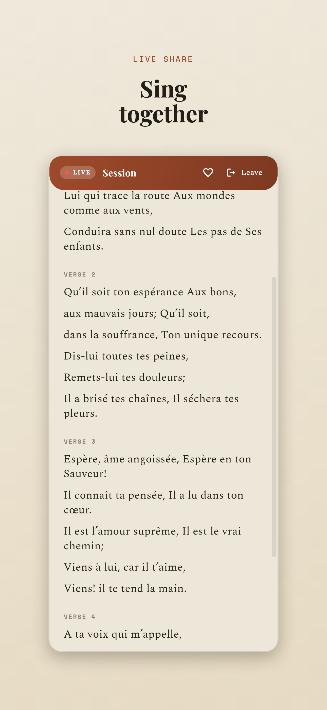
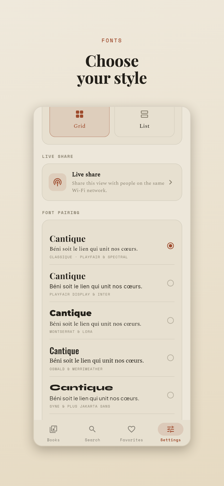
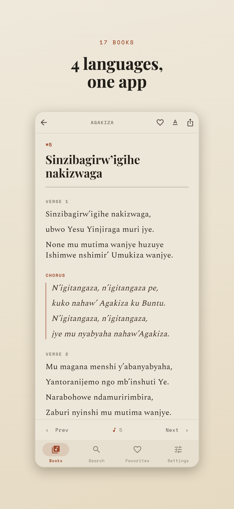

# Indirimbo Zikundwa

A clean, **offline-first Flutter app** (Android · iOS · Web) for reading
Christian hymn collections in **Kirundi, Kinyarwanda, Swahili and French**.

The hymn content comes from **[missionnaire.net](https://www.missionnaire.net/)**.
This app bundles the songs locally so they are fully readable **without an
internet connection**.

> **5,495 songs · 17 collections** — Umuco 1/2, Ikirundi, Iz'i Gisenyi,
> Gushimisha, Agakiza, Wokovu, Nyimbo za Mungu, Tenzi za Rohoni, Les Ailes de la
> Foi, Chants de Victoire, Coll. des Cantiques, Crois Seulement, Impimbano,
> Chorus, Izindi…

## Screenshots

<p>
  
  
  
  
  
</p>

_More sizes & French captions in [`store/`](store/) — `appstore/{en,fr}`
(1290×2796) and `playstore/{en,fr}` (1080×1920)._

## Features

- **Fully offline** — the whole corpus is a bundled JSON asset; no network needed.
- **Fast search** by number, title or lyrics, across all books or within one.
- **"Cantica" classic-hymnal design** — warm parchment palette, high-contrast
  serif titles (Playfair Display), a readable book serif (Spectral) for reading,
  and a typewriter monospace (Space Mono) for labels — all bundled. Solid
  single-colour book-spine covers, one deep library colour per collection.
- **Printed-hymnal line layout** — verses/refrains are broken into hymn lines at
  clause punctuation, so songs read like a printed book rather than a paragraph.
- **Uniform titles** — ALL-CAPS source titles are normalised to sentence case
  (divine names kept capitalised).
- **Selectable font pairings** — Settings → *Combinaison de polices*: Playfair &
  Inter, Montserrat & Lora, Oswald & Merriweather, Syne & Plus Jakarta Sans,
  Cormorant Garamond & Source Sans 3, Archivo Black & Roboto Mono, Fraunces & DM
  Sans, Space Grotesk & Arimo (+ default Playfair & Spectral). Live preview.
- **Language grouping & sorting** — filter the library by Kirundi / Kinyarwanda /
  Swahili / Français / Combiné; grid or list layout; sort A→Z (default), Z→A,
  most songs, or book order.
- **Immersive reading** — double-tap the lyrics for distraction-free fullscreen
  (double-tap again to exit), **pinch to zoom** the text, and an optional
  **keep-screen-on** while reading (on by default).
- **Bilingual UI** (Français / English).
- **Three reading themes** — Clair / Sépia / Sombre — plus font size & line spacing.
- **Favorites** and A/B song variants (same number, two versions).
- **Live share (SharePlay-style)** — one device hosts and others on the same
  Wi‑Fi mirror the song + scroll position live; followers can scroll on their own
  and like songs. Web devices can join via a link/address (see below).

## Project layout

```
app/                       Flutter application
  assets/data/hymns.json   bundled dataset (generated by the scraper)
  assets/fonts/            bundled UI + reading fonts
  lib/src/data/            models, repository, language grouping
  lib/src/state/           Riverpod providers (settings, favorites, search, share)
  lib/src/theme/           themes, font combos, reader palette
  lib/src/ui/              screens (home, collection, reader, search, settings…)
  lib/src/share/           local-network live-share transport
  test/                    dataset / title / line / share-transport tests
  tools/share_host.dart    CLI live-share host (for testing without a device)
tools/                     Node scraper + Playwright screenshot/demo scripts
store/                     App Store / Play Store screenshots
demo/                      recorded walkthrough
```

## Run / develop

```bash
export PATH="$HOME/flutter/bin:$PATH"
cd app
flutter pub get
flutter run                 # connected device / simulator
flutter run -d chrome       # in the browser
flutter test                # run the test suite
flutter analyze             # lint
```

## Build for release

```bash
cd app
flutter build apk --release           # Android APK
flutter build appbundle --release     # Android App Bundle (Play Store upload)
flutter build ipa --release           # iOS (requires Xcode + signing)
flutter build web --release           # Web (PWA)
```

App identifiers: bundle id **`bi.indirimbo.indirimbo`**, display name
**“Indirimbo Zikundwa”**, version `1.0.0+1` (bump `version:` in
`app/pubspec.yaml` per release). App icons are generated with
`flutter_launcher_icons` (`dart run flutter_launcher_icons`).

### Store assets

Captioned marketing screenshots (French + English) are in [`store/`](store/) —
Apple sizes (`store/appstore/{en,fr}/`, 1290×2796, 6.7″) and Play sizes
(`store/playstore/{en,fr}/`, 1080×1920). Regenerate with `tools/store_shots.mjs`
(see below).

## Live share — quick local test (Mac + phone, no Xcode needed)

```bash
cd app && flutter build web --release
cd build/web && python3 -m http.server 8099 --bind 0.0.0.0   # serve on the LAN
# in another terminal:
cd app && dart run tools/share_host.dart auto                # CLI host
```

On the phone (same Wi‑Fi) open `http://<mac-ip>:8099/?join=ws://<mac-ip>:<port>`
(the host prints the exact line). The phone mirrors the host live.

> iOS needs Local Network permission (`NSLocalNetworkUsageDescription`, set);
> Android needs `INTERNET` + `CHANGE_WIFI_MULTICAST_STATE` (set). Devices must
> share the same Wi‑Fi/subnet with AP isolation off. ws:// is blocked from an
> https page (mixed content) — serve the web build over http on the LAN.

## Regenerate the dataset

```bash
cd tools
npm install
node scrape.mjs             # rebuilds app/assets/data/hymns.json
```

## Regenerate store screenshots

```bash
cd app && flutter build web --release
cd build/web && python3 -m http.server 8099 &
cd app && dart run tools/share_host.dart auto &   # for the live-share shot
cd ../tools && npm install && npx playwright install chromium
node store_shots.mjs        # writes ../store/{appstore,playstore}/{fr,en}/*.png
```

## Credits & license

Hymn content © its respective authors, published by
**[missionnaire.net](https://www.missionnaire.net/)**. This app is an
independent offline reader for that content. Application code is released under
the MIT License (see [`LICENSE`](LICENSE)).
